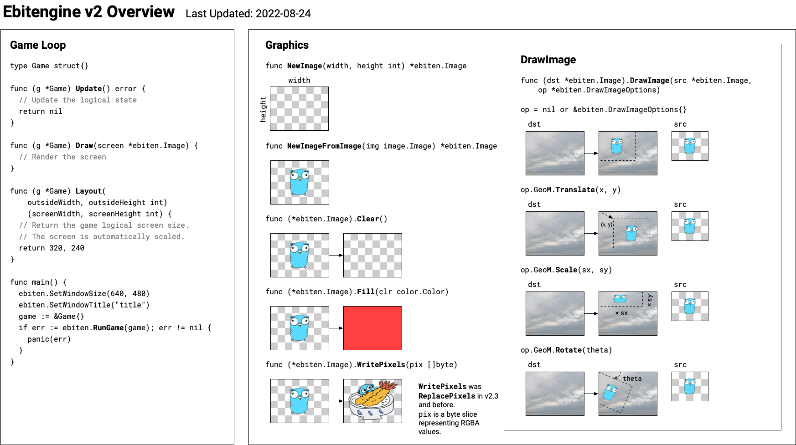

+++
date = '2025-02-06T14:42:23+08:00'
draft = true
title = '[Ebitengine] (二) API手册'
description = ""
summary = "This cheat sheet describes the essential APIs that are commonly used. For the complete list of the API, see the [API reference](https://pkg.go.dev/github.com/hajimehoshi/ebiten/v2)."
tags = ["Ebitengine", "Golang"]
# categories = [""]
# menu = "main"
+++

## Overview



## General

### `ebiten.Game`

```go
type Game interface {
    // Update updates a game by one tick.
    Update() error

    // Draw draw the game screen. The given argument represents a screen image.
    Draw(screen *Image)

    // Layout accepts a native outside size in device-independent pixels and returns the game's logical
    // screen size. On desktops, the outside is a window or a monitor (fullscreen mode)
    //
    // Even though the outside size and the screen size differ, the rendering scale is automatically
    // adjusted to fit with the outside.
    //
    // You can return a fixed screen size if you don't care, or you can also return a calculated screen
    // size adjusted with the given outside size.
    Layout(outsideWidth, outsideHeight int) (screenWidth, screenHeight int)
}
```

`Game` 接口定义.

### `ebiten.RunGame`

```go
func RunGame(game Game) error
```

`RunGame` 运行游戏。游戏的更新在每个`tick`（默认情况下为 1/60 [s]）调用，游戏的绘制在每帧调用（对于 60Hz 显示，通常为 1/60[s]）。参数 (`*Image`) 是代表屏幕的渲染目标。

默认情况下，当窗口未获得焦点时，不会调用 `Update` 和 `Draw`。此设置可通过 `SetRunnableOnUnfocused` 进行配置。

当 (1).OpenGL 错误发生 (2).音频错误发生或 (3).游戏更新返回错误时，`RunGame` 返回错误。在 (3) 的情况下，`RunGame` 返回相同的错误。

不要在一个进程中调用 `RunGame` 两次或多次。

Game 和 RunGame 的典型代码是这样的：

```go
// Game implements ebiten.Game interface.
type Game struct{}

// Update proceeds the game state.
// Update is called every tick (1/60 [s] by default).
func (g *Game) Update() error {
    // Write your game's logical update.
    return nil
}

// Draw draws the game screen.
// Draw is called every frame (typically 1/60[s] for 60Hz display).
func (g *Game) Draw(screen *ebiten.Image) {
    // Write your game's rendering.
}

// Layout takes the outside size (e.g., the window size) and returns the (logical) screen size.
// If you don't have to adjust the screen size with the outside size, just return a fixed size.
func (g *Game) Layout(outsideWidth, outsideHeight int) (screenWidth, screenHeight int) {
    return 320, 240
}

func main() {
    game := &Game{}
    // Specify the window size as you like. Here, a doubled size is specified.
    ebiten.SetWindowSize(640, 480)
    ebiten.SetWindowTitle("Your game's title")
    // Call ebiten.RunGame to start your game loop.
    if err := ebiten.RunGame(game); err != nil {
        log.Fatal(err)
    }
}
```

### `ebiten.Run`

> Run是为了向后兼容，被RunGame取代。

### `ebitenutil.DebugPrint`

```go
func DebugPrint(image *ebiten.Image, str string)
```

DebugPrint 在图像的左上角绘制字符串 `str` 。

## Graphics

### `ebiten.Image`

```go
type Image struct {
    // contains filtered or unexported fields
}
```

`Image` 代表一个图像。 `Image` 实现了 [image.Image](https://golang.org/pkg/image/#Image) 接口。

### `ebiten.NewImage`

```go
func NewImage(width, height int) *Image
```

`NewImage` 创建一个新的空的图像。 `width` 和 `height` 是图像的宽度和高度，单位为像素。 

### `ebiten.NewImageFromImage`

```go
func NewImageFromImage(img image.Image) *Image
```

`NewImageFromImage` 从 `image.Image` 创建一个新的图像。

### `(*ebiten.Image).Clear`

```go
func (i *Image) Clear()
```

 `Clear` 清除图像的所有像素(重置为0).

 ### `(*ebiten.Image).Fill`

 ```go
 func (i *Image) Fill(color color.Color)
 ```

 `Fill` 用颜色 `color` 填充图像的所有像素。

### `(*ebiten.Image).Size`

```go
func (i *Image) Size() (width, height int)
```

`Size` 返回图像的宽度和高度。

### `(*ebiten.Image).SubImage`

```go
func (i *Image) SubImage(r image.Rectangle) image.Image
```

 `SubImage` 返回一个图像的子图像。 `r` 是子图像的矩形区域。
 
 返回值为 `*ebiten.Image` 类型。

 如果 `r` 被释放(`disposed`), 则返回 `nil`。

 ### `(*ebiten.Image).DrawImage`

 ```go
 func (i *Image) DrawImage(src *Image, op *DrawImageOptions)
 ```

 `DrawImage` 将 `src` 图像绘制到 `i` 图像上。 `op` 是绘制选项。

`DrawImage` 更高效的使用批处理，当连续的 `DrawImage` 调用满足以下条件时：

- 所有绘制目标都是相同的。`A in A.DrawImage(B, op)`
- 所有混合模式都是相同的。
- 所有滤镜都是相同的。

更多性能优化信息，请参阅 [Performance Tips](https://ebitengine.org/en/documents/performancetips.html)。

### `ebiten.DrawImageOptions`

```go
type DrawImageOptions struct {
    // GeoM is a geometry matrix to draw.
    // The default (zero) value is identify, which draws the image at (0, 0).
    GeoM GeoM

    // ColorScale is a scale of color.
    // The default (zero) value is identity, which is (1, 1, 1, 1).
    ColorScale ColorScale

    // Blend is a blending way of the source color and the destination color.
    // The default (zero) value is regular alpha blending.
    Blend Blend

    // Filter is a type of texture filter.
    // The default (zero) value is FilterNearest.
    Filter Filter
}
```

`DrawImageOptions` 代表渲染图像的选项。

### `ebiten.Filter`

 ```go
 type Filter int
 ```
 
`Filter` 代表用于放大或缩小图像的纹理过滤器类型。

```go
const (
    // FilterNearest represents nearest (crisp-edged) filter
    FilterNearest

    // FilterLinear represents linear filter
    FilterLinear
)
```

### `ebiten.GeoM`

```go
type GeoM struct {
    // contains filtered or unexported fields
}
```

 `GeoM` 代表一个几何变换矩阵。初始值为单位矩阵。

 ### `(*ebiten.GeoM).Translate`

 ```go
func (g *GeoM) Translate(tx, ty float64)
 ```

`Translate` 将矩阵平移 `(tx, ty)` 距离。

 ### `(*ebiten.GeoM).Scale`

 ```go
func (g *GeoM) Scale(sx, sy float64)
 ```

 `Scale` 将矩阵缩放 `(sx, sy)` 倍。

 ### `(*ebiten.GeoM).Rotate`

 ```go
func (g *GeoM) Rotate(theta float64)
 ```

 `Rotate` 将矩阵绕原点旋转 `theta` 弧度。

### `ebiten.ColorScale`

 ```go
type ColorScale struct {
    // contains filtered or unexported fields
}
 ```

`ColorScale` 代表`RGBA`颜色缩放。初始值为单位颜色缩放。

### `(*ebiten.ColorScale).Scale`

```go
func (c *ColorScale) Scale(r, g, b, a float64)
```

`Scale` 将颜色缩放 `(r, g, b, a)` 倍。

### `(*ebiten.ColorScale).ScaleAlpha`

```go
func (c *ColorScale) ScaleAlpha(a float64)
```

`ScaleAlpha` 将颜色的透明度缩放 `a` 倍。

## Input

### `ebiten.IsKeyPressed`

```go
func IsKeyPressed(key Key) bool
```

 `IsKeyPressed` 检查按键是否被按下。 `key` 是按键的标识符。

 ### `inpututil.IsKeyJustPressed`

 ```go
func IsKeyJustPressed(key Key) bool
```

`IsKeyJustPressed` 检查按键是否刚刚被按下。 `key` 是按键的标识符。

### `ebiten.Key`

```go
type Key int
```
`Key` 代表按键的标识符。

```go
const (
    KeyA Key
    KeyB
    KeyC
    KeyD
    KeyE
    KeyF
    KeyG
    KeyH
    KeyI
    KeyJ
    KeyK
    KeyL
    KeyM
    KeyN
    KeyO
    KeyP
    KeyQ
    KeyR
    KeyS
    KeyT
    KeyU
    KeyV
    KeyW
    KeyX
    KeyY
    KeyZ
    KeyAltLeft
    KeyAltRight
    KeyArrowDown
    KeyArrowLeft
    KeyArrowRight
    KeyArrowUp
    KeyBackquote
    KeyBackslash
    KeyBackspace
    KeyBracketLeft
    KeyBracketRight
    KeyCapsLock
    KeyComma
    KeyContextMenu
    KeyControlLeft
    KeyControlRight
    KeyDelete
    KeyDigit0
    KeyDigit1
    KeyDigit2
    KeyDigit3
    KeyDigit4
    KeyDigit5
    KeyDigit6
    KeyDigit7
    KeyDigit8
    KeyDigit9
    KeyEnd
    KeyEnter
    KeyEqual
    KeyEscape
    KeyF1
    KeyF2
    KeyF3
    KeyF4
    KeyF5
    KeyF6
    KeyF7
    KeyF8
    KeyF9
    KeyF10
    KeyF11
    KeyF12
    KeyHome
    KeyInsert
    KeyMetaLeft
    KeyMetaRight
    KeyMinus
    KeyPageDown
    KeyPageUp
    KeyPause
    KeyPeriod
    KeyPrintScreen
    KeyQuote
    KeyScrollLock
    KeySemicolon
    KeyShiftLeft
    KeyShiftRight
    KeySlash
    KeySpace
    KeyTab
    KeyAlt
    KeyControl
    KeyShift
    KeyMeta
)
```

### `ebiten.CursorPosition`

```go
func CursorPosition() (x, y int)
```

`CursorPosition` 返回鼠标光标的位置。

### `ebiten.IsMouseButtonPressed`

```go
func IsMouseButtonPressed(button int) bool
```

 `IsMouseButtonPressed` 检查鼠标按钮是否被按下。 `button` 是鼠标按钮的标识符。

 ### `inpututil.IsMouseButtonJustPressed`

 ```go
func IsMouseButtonJustPressed(button int) bool
```

`IsMouseButtonJustPressed` 检查鼠标按钮是否刚刚被按下。 `button` 是鼠标按钮的标识符。

### `ebiten.MouseButton`

```go
type MouseButton int
```

`MouseButton` 代表鼠标按钮的标识符。

```go
const (
    MouseButtonLeft   MouseButton
    MouseButtonRight
    MouseButtonMiddle
```
